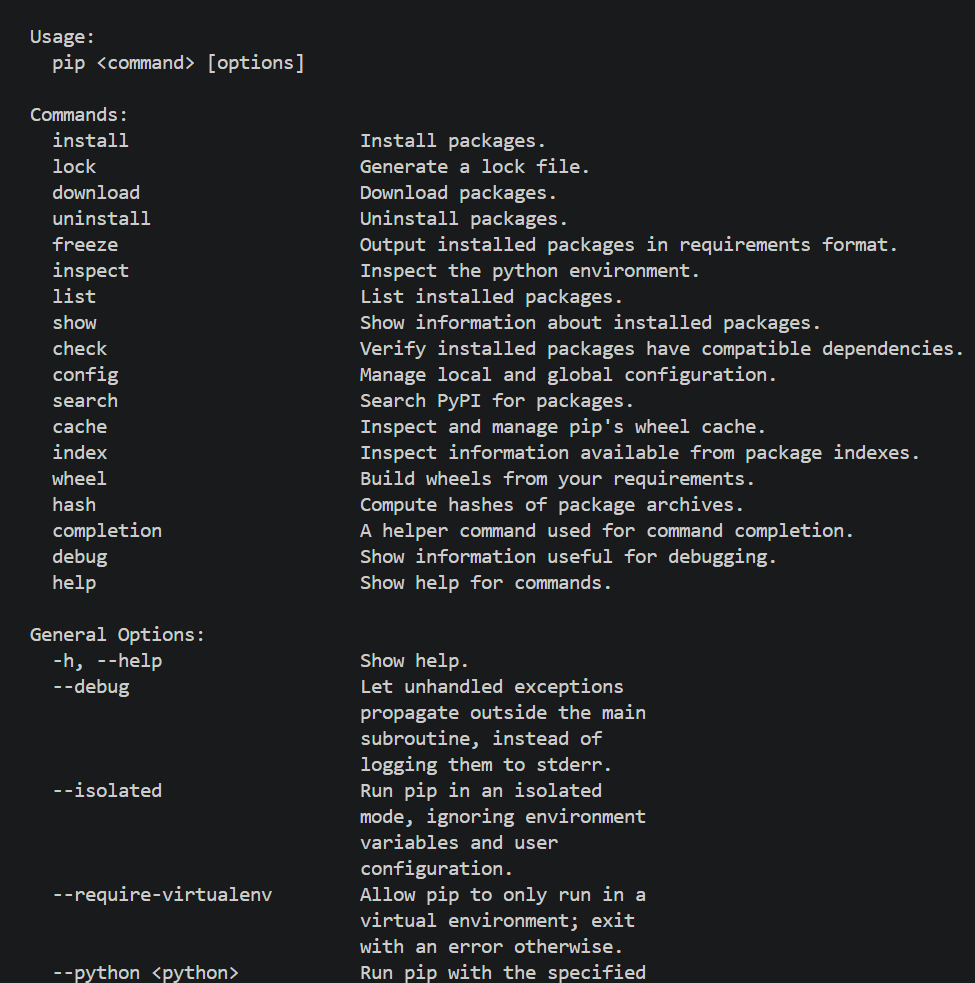
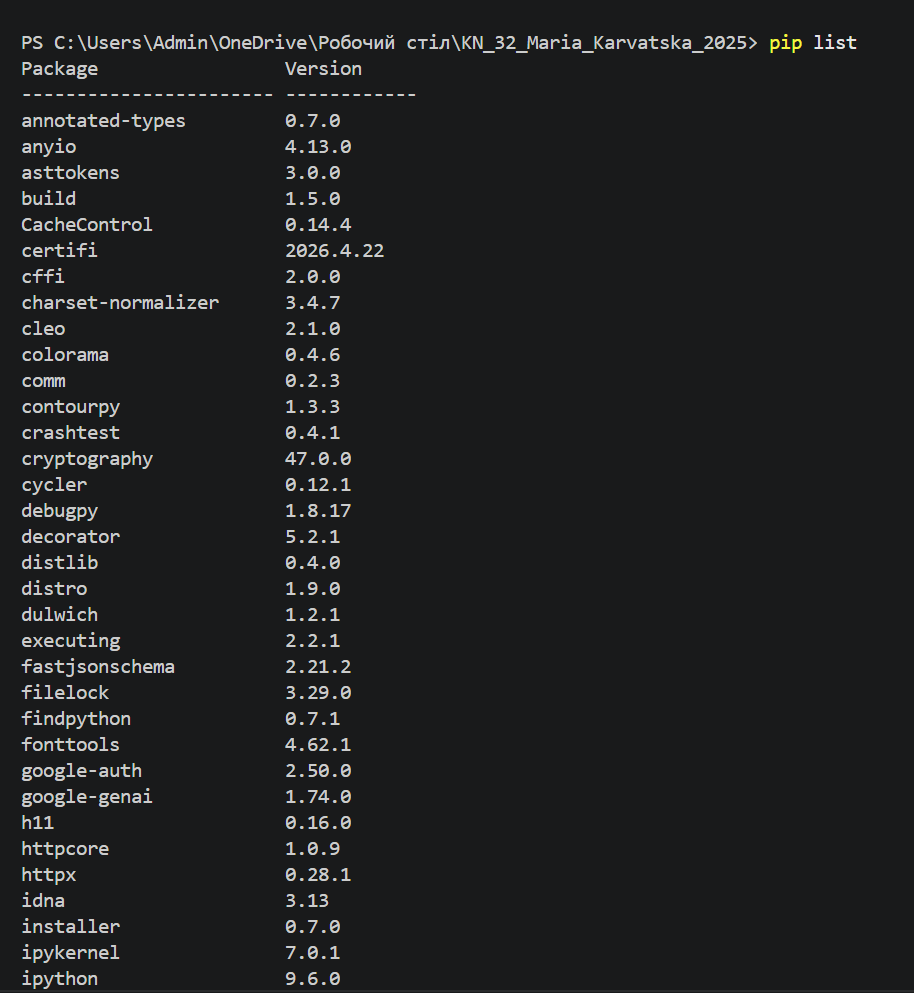
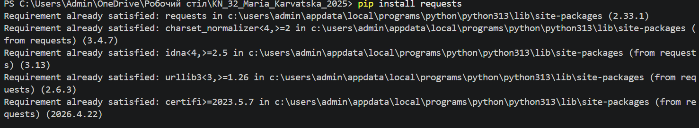
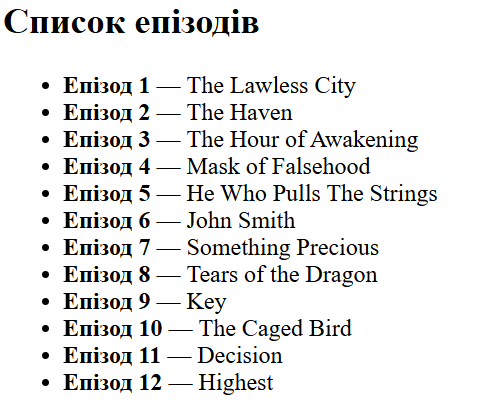
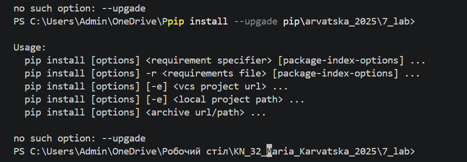
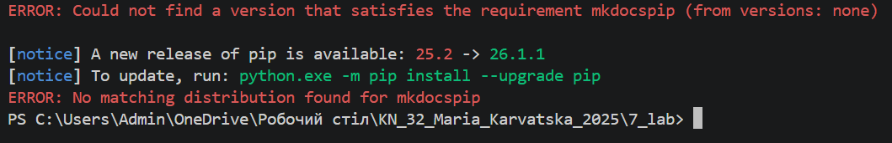

# звіт до роботи
## Віртуальні середовища

### Виконання роботи
1. Створила Python файл в якому буду виконувати завдання. >>>[URL на файл](note.ipynb)>>>>
1. Встановлюю pip на мій пк 

1. Виконала команаду pip help 

1. Перевірила які бібліотеки вже інстальовані за допомогою pip list

1. Завантажила бібліотеку pip install requests 

``` python
>>> import requests
>>> requests.__version__
'2.32.5'
>>> r = requests.get('https://google.com')
>>> r.status_code
200
>>> exit()
```
1. Встановила дану бібліотеку pip install jikanpy-v4 Flask
1. Створила та запустила файл anime.py >>>[URL на файл](anime.py)>>>>
- Ось результат

1. реезультат команд
 ```bash
>>> python -m venv ./my_env
>>> source my_env/bin/activate
>>> pip install jikanpy-v4 Flask

>>> pip freeze > requirements.txt

Після перевстановлення середовища потрібно встановити всі залежності, які описані в requirements.txt__
pip install -r requirements.txt

>>> python -m venv ./my_env && source my_env/bin/activate && pip install -r requirements.txt
>>> pip list
>>> deactivate 
```  


1. Зʼявилися проблеми з документацію за допомогою MkDocs 


## Висновок:

❓ Що зроблено в роботі;
Віртуальні середовища

❓ Чи досягнуто мети роботи;
Ні, виникли труднощі з MkDocs

❓ Які нові знання отримано;
Дізналася про ізольовані середовищі

❓ Чи вдалось відповісти на всі питання задані в ході роботи;
Ні

❓ Чи вдалося виконати всі завдання;
Ні

❓ Чи виникли складності у виконанні завдання;
Так

❓ Чи подобається такий формат здачі роботи (Feedback);
Так

❓ Побажання для покращення (Suggestions);
Побажань не має

